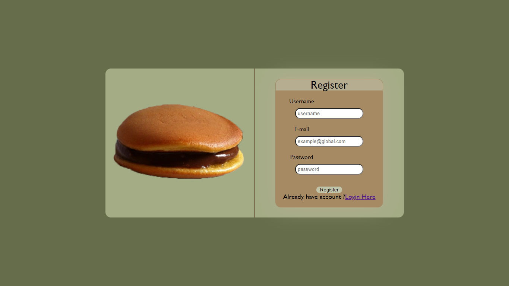
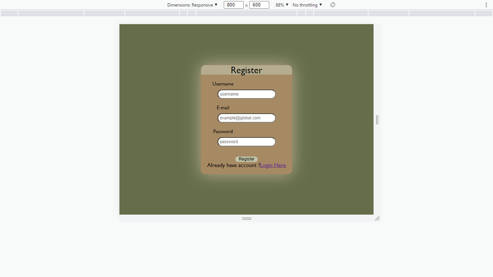
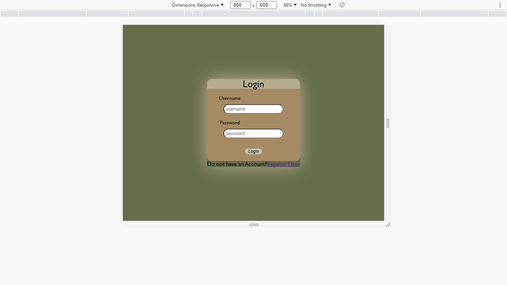

# World Break Down Web App

## Description
Sebuah aplikasi e-commerce sederhana menjual varian dorayaki

## Prerequisites
- nginx / apache
- php 8.x
- sqlite php extension enabled
- php pdo

## Menjalankan server
- Jalankan nginx atau apache
- Jalankan perintah berikut pada root directory, port 8080 dapat diganti sesuai kondisi
`php -S localhost:8080`
- Pada browser buka `localhost:8080` atau port yang sesuai

## Menjalankan docker
- Pada working directory jalankan `docker compose up -d` dan buka pada browser `localhost:8000`

## Keterangan tambahan

### File tambahan (diluar aplikasi / sebagai developer)
- seeder.php digunakan untuk menginput data dummy
- database/initDb.php digunakan untuk melakukan drop tables kemudian input tables (users, products, histories). Ini juga melakukan input data admin dan user dummy.
- Berikut akun yang dapat digunakan diawal :
    * username : admin  password : admin123
    * username : user password : user123 

### Screenshot
- Register

- Login

### Pembagian Tugas
- Server-side
    * Model & Database : 13519197
    * Login : 13519197
    * Register : 13519197
    * Dashboard : 13519197
    * Pencarian : 13519197
    * Penambahan Dorayaki : 13519197
    * Edit dorayaki : 13519197
    * Detail Dorayaki :
    * Pengubahan/Pembelian Dorayaki : 
    * Expire-time : 13519197
    * Docker : 13519197
    * Riwayat Pengubahan/Pembelian :
    * Delete dorayaki : 13519197

- Client-side
    * Login : 13519065
    * Register :
    * Dashboard : 13519197
    * Pencarian : 13519065, 13519197
    * Penambahan Dorayaki : 13519197
    * Edit dorayaki : 13519197
    * Detail Dorayaki : 13519065
    * Pengubahan/Pembelian Dorayaki :
    * Riwayat Pengubahan/Pembelian : 13519065

### Bonus
- Edit product
- Riwayat
- Docker
- Token
- Responsive design

### Buatlah file README yang berisi:
    * Deskripsi aplikasi web
    * Daftar requirement
    * Cara instalasi
    * Cara menjalankan server
    * Screenshot tampilan aplikasi (tidak perlu semua kasus, minimal 1 per halaman), dan 
    * Penjelasan mengenai pembagian tugas masing-masing anggota (lihat formatnya pada bagian pembagian tugas).

